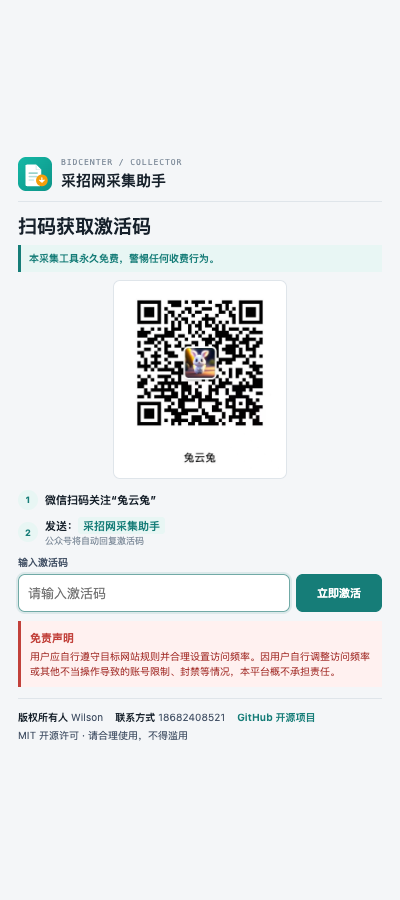
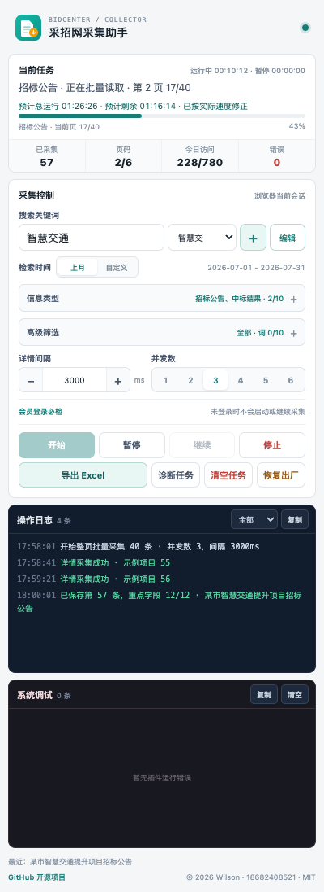
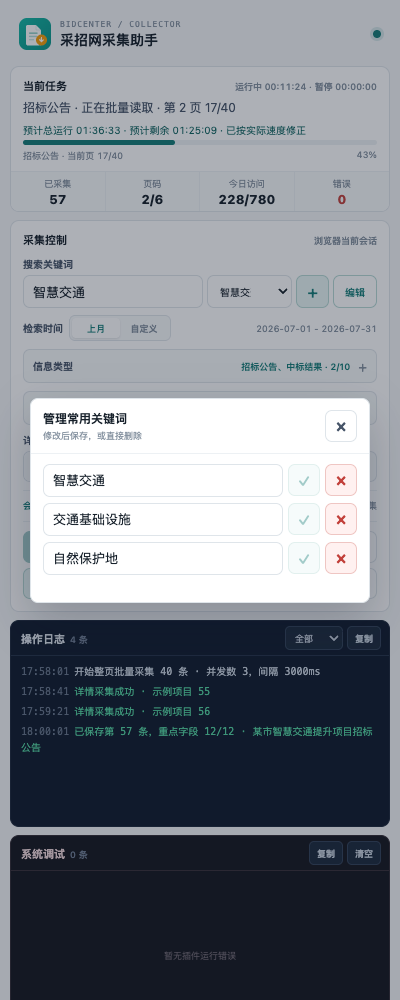

<p align="center">
  
</p>

# 采招网采集助手


[项目地址](https://github.com/HachikoJ/BidCenter-Collector) · [下载最新版本](https://github.com/HachikoJ/BidCenter-Collector/releases/latest) · [安装方法](#安装方法) · [产品截图](#产品截图) · [问题反馈](#联系作者)

**面向采招网会员用户的 Chrome 侧边栏采集与 Excel 导出工具。**

插件使用当前浏览器中已经登录的采招网会员会话，按关键词、时间、信息类型和高级条件采集用户有权访问的信息，支持整页并发、暂停续采、每日访问保护、运行日志、系统诊断和 Excel 导出。

**GitHub 访问地址：** [https://github.com/HachikoJ/BidCenter-Collector](https://github.com/HachikoJ/BidCenter-Collector)

> [!IMPORTANT]
> **本采集工具永久免费，警惕任何收费行为。** 项目采用 MIT 开源许可。任何人以本工具名义收取激活费、会员费或代采费，均与本项目无关。

> [!WARNING]
> 本项目不是采招网官方产品，与采招网不存在隶属、授权或合作关系。用户必须自行遵守目标网站规则、会员协议和适用法律，仅采集自己有权访问的信息。因用户自行调整访问频率或其他不当操作导致的账号限制、封禁等情况，本项目不承担责任。

## 为什么做这个

采招网会员页面的信息类型多、详情结构不完全统一，手工逐条打开、复制和整理 Excel 很耗时间。这个插件把重复操作集中到浏览器侧边栏中完成，同时保留详情正文全文、结构化字段证据、失败原因和运行日志，便于后续核对或使用本地 AI 再分析。

项目不绕过登录、验证码、会员权限或访问控制，也不伪造请求头。所有页面访问都通过用户自己的 Chrome 会话完成。

## 产品截图

### 扫码激活首页

<p>
  
</p>

首次使用时扫描“兔云兔”公众号二维码，关注后发送“采招网采集助手”获取公益激活码。首页同时展示永久免费提醒、联系方式、免责声明和 GitHub 开源项目入口。

### 采集操作页面

<p>
  
</p>

操作页集中展示当前任务、预计耗时、分页进度、今日访问数、关键词、筛选条件、间隔、并发数、开始暂停与导出操作，以及运行日志和系统调试信息。

### 常用关键词管理

<p>
  
</p>

默认提供“智慧交通”“交通基础设施”“自然保护地”，支持新增、修改、删除和本机持久化保存。

## 核心功能

- 侧边栏控制：插件常驻 Chrome 右侧，不占用用户鼠标和当前网页操作。
- 强制会员登录检查：开始、继续和每个分页采集前都会检查登录状态。
- 多条件检索：支持关键词、上月整月或自定义日期、信息类型、高级筛选、排除词和相关词。
- 多信息类型顺序采集：默认采集招标公告和中标结果，也可勾选其他官网类型。
- 整页并发采集：当前分页的详情按用户设置的并发数在后台处理。
- 动态时间预估：显示预计总运行时间、剩余时间和可能跨日提示，并按实际速度修正。
- 暂停与断点续采：暂停后保留已完成结果，恢复时按网址和信息 ID 去重。
- 每日访问保护：按本机自然日统计插件详情访问，在 780 条处暂停，给平台 800 条上限保留缓冲。
- 人机验证等待：检测到验证或访问过于频繁时暂停 60 秒，之后刷新并继续尝试。
- 完整内容留存：除结构化字段外，还保存详情页正文全文和字段证据。
- Excel 导出：暂停、停止或完成后均可导出当前已保存结果。
- 操作日志与系统诊断：记录每条自动操作、字段缺失和插件运行错误，可一键复制给开发者。

## 安装方法

### 从 GitHub 下载

1. 打开[最新版本下载页](https://github.com/HachikoJ/BidCenter-Collector/releases/latest)。
2. 下载发布附件并解压到本地固定目录，不要在加载后移动或删除该目录。
3. 在 Chrome 地址栏打开 `chrome://extensions`。
4. 开启右上角“开发者模式”。
5. 点击“加载已解压的扩展程序”，选择包含 `manifest.json` 的解压目录。
6. 建议将“采招网采集助手”固定到浏览器工具栏。

macOS 用户也可以双击项目中的 `安装采招网采集助手.command`，它会打开 Chrome 扩展管理页并显示应选择的当前目录。

### 从源码安装

```bash
git clone https://github.com/HachikoJ/BidCenter-Collector.git
cd BidCenter-Collector
```

然后在 `chrome://extensions` 中选择当前项目目录。项目不需要安装依赖或执行构建命令。

## 使用流程

1. 打开[采招网](https://www.bidcenter.com.cn/)并手动登录会员账号。
2. 点击浏览器工具栏中的插件图标，在右侧打开采集助手。
3. 首次使用时扫码获取公益激活码，输入或粘贴后激活。
4. 输入关键词，或从常用词列表选择；需要时可新增、编辑或删除常用词。
5. 选择检索时间、信息类型、高级条件、排除词、相关词、详情间隔和并发数。
6. 点击“开始”，在侧边栏查看当前分页、采集数量、时间预估和日志。
7. 可随时暂停并导出当前结果；恢复后从保存的断点继续。
8. 任务完成后尽快下载 Excel，避免浏览器清理扩展存储后结果失效。

## 导出内容

Excel 保留常用招投标字段，并尽量提取：

- 信息 ID、标题、省份、城市、信息类型、中标时间、截止时间、发布日期。
- 招标方式、项目编号、招标单位、中标单位、代理机构。
- 项目预算、资金来源、中标金额、评标办法、资质证书。
- 业主、中标单位和代理机构联系人及联系电话。
- 信息详情、详情页正文全文、结构化字段证据、网址、采集状态和失败原因。

页面没有对应字段时保持空白，不使用无依据内容补齐。

## 数据、权限与隐私

- 采集结果、任务断点、关键词、设置和日志保存在用户本机 Chrome 扩展存储中。
- 插件只声明运行所需的 `storage`、`tabs`、`downloads`、`scripting`、`alarms`、`sidePanel` 和目标网站访问权限。
- 插件不上传采集结果，不包含远程分析服务，也不读取用户在其他网站的数据。
- 点击“清空任务”会移除任务与结果；“恢复出厂”会清除激活状态、任务、日志、关键词和设置，但保留当日访问计数。
- “今日访问”在创建详情页前计数，即使加载失败也会保守计入，避免并发任务突破保护线。

## 访问限制与风险控制

平台会员账号每天最多查看 800 条详情。插件默认在 780 条处暂停，但无法获知同一账号在其他设备、其他浏览器或用户手动打开的详情数量。如果当天还进行了大量人工访问，应提前暂停任务。

默认详情间隔为 `3000ms`、默认并发数为 `3`。用户自行调高并发或缩短间隔会增加触发平台限制的风险。插件检测到人机验证或访问频繁提示时只会等待和重试，不会尝试绕过验证、登录、会员或访问控制。

## 项目结构

```text
manifest.json          Chrome Manifest V3 配置
background.js          后台任务、并发详情页、额度和断点管理
content.js             官网页面操作、列表识别和详情字段提取
sidepanel.html         侧边栏界面
sidepanel.css          侧边栏样式
sidepanel.js           控制交互、日志、诊断和任务状态
xlsx-export.js         Excel 生成与下载
icons/                 Chrome 扩展图标
docs/screenshots/      GitHub 产品截图
```

## 边界说明

- 目标网站结构变化后，页面定位和字段提取规则可能需要更新。
- 详情页缺少的字段保持空白；正文全文用于人工核对或本地 AI 二次分析。
- 激活码存放在客户端源码中。公开项目后，技术用户可以查看或修改客户端逻辑，因此扫码激活只是公益产品的使用引导，不是服务端授权或不可绕过的访问控制。
- 本项目不会提供绕过验证码、反爬限制、会员权限、每日访问上限或其他平台安全措施的功能。
- 仓库不包含采招网官方会员导出模板、用户采集数据、账号 Cookie、Token 或其他个人凭据。

## 更新记录

### 2026-08-14 · v1.9.27

- 建立 GitHub 公开项目、中文 README、产品截图和发布下载入口。
- 在激活首页和采集操作页增加 GitHub 开源项目访问链接。
- 常用关键词支持新增、编辑、删除和刷新后持久化。
- 激活首页支持复制粘贴激活码，缩小二维码并强化永久免费与免责声明提示。
- 增加当次任务预计总耗时、剩余时间、实际速度修正和跨日提醒。

## 开源授权

本项目基于 [MIT License](LICENSE) 开源。你可以自由使用、复制、修改、合并、发布和分发本项目，但必须保留原始版权与许可声明。

开源不代表可以冒充官方、误导收费、绕过目标网站权限或用于违法用途。

## 联系作者

欢迎提交 [Issue](https://github.com/HachikoJ/BidCenter-Collector/issues) 反馈页面适配、字段提取或导出问题。请勿在 Issue 中公开会员账号、Cookie、Token、联系电话或采集结果等敏感数据。

- 作者：Wilson
- GitHub：[HachikoJ](https://github.com/HachikoJ)
- 手机 / 微信：`18682408521`
- 微信号：`hostrow`
- 邮箱：`946106011@qq.com`
- 微信公众号：兔云兔，关注后发送“采招网采集助手”获取公益激活码

<p>
  
</p>

---

如果这个项目对你有帮助，可以在 GitHub 点一个 Star；如发现目标网站改版，请附上脱敏截图和系统调试信息提交 Issue。
