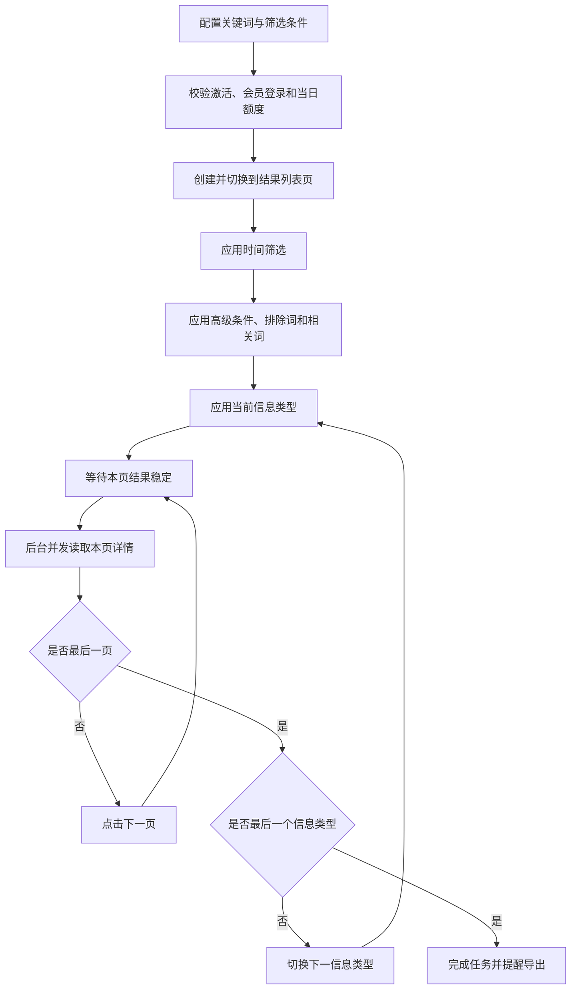

# 采招网采集助手产品需求文档（PRD）

## 1. 文档信息

| 项目 | 内容 |
| --- | --- |
| 产品名称 | 采招网采集助手 |
| 产品形态 | Chrome Manifest V3 扩展、Chrome 侧边栏应用 |
| 当前基线 | v2.4 |
| 文档类型 | 已实现功能基线 PRD（As-Built PRD） |
| 目标用户 | 已购买并登录采招网会员账号的中国用户 |
| 版权所有人 | Wilson |
| 联系方式 | 18682408521 |
| 开源许可 | MIT |
| 项目地址 | https://github.com/HachikoJ/BidCenter-Collector |
| 更新日期 | 2026-08-17 |

本文档描述 v2.4 代码中已经实现的产品能力、业务规则、边界和验收标准。除“已知限制”外，不把规划项或设想写成已交付功能。

## 2. 产品概述

### 2.1 产品定位

采招网采集助手是一款面向采招网会员用户的本地 Chrome 扩展。用户在浏览器中手动登录会员账号后，可通过右侧边栏配置检索条件、批量读取列表和详情、暂停或断点续采，并将当前已保存数据导出为 Excel。

插件复用用户当前 Chrome 登录会话，不提供账号托管，不上传采集结果，不依赖云端采集服务。

### 2.2 用户问题

- 招投标列表分页多，逐条打开详情、复制字段和整理 Excel 耗时。
- 不同信息类型和详情模板的字段位置不统一，人工整理容易遗漏。
- 长任务可能跨日、触发会员访问额度或因网络和验证中断。
- 仅提取结构化字段不足以覆盖所有页面，需要保留正文和提取证据以便复核。
- 自动任务发生异常时，普通用户难以提供足够信息给开发者定位。

### 2.3 产品目标

1. 在不托管用户账号的前提下，自动完成检索、筛选、分页和详情采集。
2. 兼顾采集效率、网站访问节奏和本地浏览器稳定性。
3. 即使部分字段提取失败，也保留正文全文、列表摘要和失败原因。
4. 任务暂停、额度用尽、验证或网络异常后，尽可能从已有断点继续。
5. 让用户能够查看完整操作日志和可复制的系统级诊断信息。

### 2.4 非目标

- 不提供采招网账号注册、充值、续费或会员权益。
- 不绕过登录、会员权限、付费内容权限或平台每日访问上限。
- 不提供云端任务、跨设备同步、团队协作或定时无人值守服务。
- 不承诺对目标网站未来所有页面结构永久兼容。
- 不对采集结果进行法律、商业或投资判断。
- 不把缺失字段通过猜测或生成内容补齐。

## 3. 用户、场景与前置条件

### 3.1 用户角色

| 角色 | 诉求 | 权限 |
| --- | --- | --- |
| 采集用户 | 配置任务、采集本人有权访问的信息、导出 Excel | 使用全部侧边栏功能 |
| 开发维护人员 | 根据日志、诊断和错误堆栈定位问题 | 读取用户主动复制的诊断文本 |
| 项目所有者 | 维护激活引导、版本、开源项目和免责声明 | 维护项目代码与发布内容 |

### 3.2 典型场景

- 按“智慧交通”检索上个月整月的招标公告和中标结果。
- 按采购方式、资金来源、评标办法或资质证书进一步筛选。
- 添加排除词和相关词，减少无关结果。
- 采集过程中暂停并导出阶段性结果。
- 当日达到插件保护线后，次日从当前分页继续。
- 出现滑块、频控、网络异常或页面字段缺失时查看日志并恢复。

### 3.3 前置条件

1. 桌面版 Chrome 支持 Manifest V3 和 Side Panel API。
2. 扩展已通过“加载已解压的扩展程序”安装并启用。
3. 用户已在 Chrome 中手动登录采招网会员账号。
4. 首次使用已完成公益激活。
5. 用户网络能够访问 `www`、`search`、`user` 和 `shuju.bidcenter.com.cn`。

## 4. 产品信息架构

### 4.1 激活页

- 产品 Logo、名称和版本号。
- “本采集工具永久免费，警惕任何收费行为”提示。
- “兔云兔”公众号二维码。
- 获取流程：扫码关注，发送“采招网采集助手”，获取激活码。
- 激活码输入框和激活按钮。
- 免责声明、版权所有人、联系方式、GitHub 和 MIT 信息。

### 4.2 采集操作页

1. 顶部品牌区：Logo、版本、GitHub、版权、联系方式、许可和任务状态点。
2. 当前任务区：状态、运行/暂停耗时、时间预估、进度条和核心指标。
3. 采集控制区：关键词、时间、类型、高级筛选、间隔、并发和任务按钮。
4. 操作日志区：级别筛选、数量、完整日志和复制。
5. 系统调试区：系统错误、复制诊断和清空。
6. 版本历史区：按版本展示用户可感知的功能变化。
7. 常用关键词管理弹窗：编辑、保存和删除本地关键词。

## 5. 核心业务流程

### 5.1 首次使用

1. 用户点击扩展图标，Chrome 打开右侧边栏。
2. 未激活时仅显示激活页。
3. 用户扫码关注公众号并发送指定关键词。
4. 用户输入或粘贴 11 位数字激活码。
5. 校验成功后在本机保存激活状态并进入操作页。

### 5.2 新建采集任务

1. 用户在采招网页面手动登录会员账号。
2. 用户输入或选择关键词，配置时间、信息类型和其他筛选条件。
3. 用户设置详情间隔和并发数。
4. 用户点击“开始”。
5. 插件校验激活状态、会员登录状态和当日剩余额度。
6. 插件新建结果列表标签，自动激活该标签并聚焦其浏览器窗口。
7. 结果页按“时间 → 高级条件/词 → 当前信息类型”的顺序应用筛选。
8. 当前分页结果稳定后，插件整页分配详情采集任务。
9. 详情标签在后台静默打开；完成后关闭并保存结果。
10. 当前页完成后进入下一页；当前类型完成后进入下一选中类型。
11. 所有类型完成后结束任务、关闭结果列表标签并提醒尽快导出。

### 5.3 暂停与继续

1. 点击“暂停”后，任务状态变为 `paused`，暂停计时开始。
2. 已完成记录、分页、当前类型、部分结果和错误继续保存在本机。
3. 等待中的采集通道在检查到暂停状态后退出，不再打开新详情。
4. 用户可在暂停状态导出已经保存的数据。
5. 点击“继续”时重新校验激活、会员登录和当日额度。
6. 用户当前设置的间隔和并发写入任务并立即接管后续节奏。
7. 插件激活已保存的结果页；如果标签已不存在，则按保存 URL 重建。
8. 页面接收端缺失时刷新一次，由 Manifest 自动注入内容脚本后继续。

### 5.4 结束与导出

- “停止”终止当前批次，关闭后台详情和列表标签，保留已保存记录供导出。
- 正常完成后保留结果并显示实际运行时间、暂停时间和尽快导出提醒。
- “清空任务”先停止任务并排空写入，再删除任务、结果和本次操作日志。
- “恢复设置”需二次确认，清除激活、任务、结果、日志、错误、校准数据、自定义关键词和设置，但保留当日访问计数。

## 6. 功能需求

### 6.1 公益激活

| 编号 | 需求 |
| --- | --- |
| FR-ACT-01 | 未激活时必须阻止进入采集操作页。 |
| FR-ACT-02 | 激活页必须展示二维码、公众号名称、发送关键词和永久免费提示。 |
| FR-ACT-03 | 输入框仅保留数字，最多 11 位，支持键盘输入和粘贴。 |
| FR-ACT-04 | 当前客户端校验码为 `18682408521`；错误时显示“激活码不正确”。 |
| FR-ACT-05 | 激活成功后保存激活时间并立即进入操作页。 |
| FR-ACT-06 | 激活页必须展示 Wilson、18682408521、GitHub、MIT 和免责声明。 |

激活是公益产品的使用引导，不是服务端授权系统。校验逻辑和激活码位于客户端代码中。

### 6.2 会员登录校验

| 编号 | 需求 |
| --- | --- |
| FR-LOGIN-01 | 开始、继续和每个分页的详情批次开始前必须校验会员登录。 |
| FR-LOGIN-02 | 不提供“跳过登录检查”选项。 |
| FR-LOGIN-03 | 优先检查已知结果页，再检查当前浏览器中其他采招网页面。 |
| FR-LOGIN-04 | 无可判断页面时可静默打开采招网首页探测，完成后关闭探测页。 |
| FR-LOGIN-05 | 识别用户中心、会员级别、退出入口等已登录标志。 |
| FR-LOGIN-06 | 识别登录页、登录/注册入口和密码输入框等未登录标志。 |
| FR-LOGIN-07 | 未登录或无法确认时进入 `login_required`，保存断点并提示用户处理。 |

### 6.3 关键词输入与管理

| 编号 | 需求 |
| --- | --- |
| FR-KW-01 | 关键词使用“输入框 + 下拉按钮”一体式组合控件。 |
| FR-KW-02 | 默认关键词为：智慧交通、交通基础设施、自然保护地。 |
| FR-KW-03 | 下拉选择后自动填入输入框，用户仍可继续编辑。 |
| FR-KW-04 | 输入内容非空且与已有项不重复时才允许新增。 |
| FR-KW-05 | 关键词按中文区域不区分大小写去重，单项最长 80 个字符。 |
| FR-KW-06 | 管理弹窗支持修改、回车保存、图标保存和删除。 |
| FR-KW-07 | 未修改、空值或与其他项重复时不得保存。 |
| FR-KW-08 | 自定义关键词保存在本机 Chrome 扩展存储中。 |

### 6.4 时间筛选

| 编号 | 需求 |
| --- | --- |
| FR-TIME-01 | 默认模式为“上月”，范围是任务启动日期对应的上一个完整自然月。 |
| FR-TIME-02 | 界面必须显示实际起止日期，格式为 `YYYY-MM-DD`。 |
| FR-TIME-03 | 用户可切换“自定义”并选择开始、结束日期。 |
| FR-TIME-04 | 开始和结束日期必须完整，且开始日期不得晚于结束日期。 |
| FR-TIME-05 | 时间筛选通过官网自定义时间参数和页面输入值共同确认。 |
| FR-TIME-06 | 结果有数据时需稳定 800ms；官网明确显示无结果时也可判定筛选完成。 |
| FR-TIME-07 | 45 秒内未确认筛选生效时进入错误流程。 |

### 6.5 信息类型

可选类型共 10 项，按固定官网顺序执行：

1. 招标公告
2. 招标变更
3. 中标结果
4. 采购信息
5. 招标预告
6. 审批公示
7. 拍卖转让
8. 土地挂牌
9. 司法拍卖
10. 其它公告

| 编号 | 需求 |
| --- | --- |
| FR-TYPE-01 | 默认勾选“招标公告”和“中标结果”。 |
| FR-TYPE-02 | 至少选择一个类型才能开始任务。 |
| FR-TYPE-03 | 每次只向官网应用一个信息类型筛选。 |
| FR-TYPE-04 | 当前类型全部分页完成后，自动切换到下一个已选类型。 |
| FR-TYPE-05 | 某类型明确无结果时记录日志并继续下一类型。 |
| FR-TYPE-06 | 必须通过控件选中状态和稳定结果共同确认筛选生效。 |

### 6.6 高级筛选、排除词和相关词

高级筛选字段：采购方式、资金来源、评标办法、资质证书。默认均为“全部”。

| 编号 | 需求 |
| --- | --- |
| FR-FILTER-01 | 优先从官网当前结果页读取可选项，并保存供侧边栏展示。 |
| FR-FILTER-02 | 官网选项尚未读取时使用内置兜底选项。 |
| FR-FILTER-03 | 所选值在官网不存在时停止并提示具体字段和值。 |
| FR-FILTER-04 | 排除词和相关词各最多 5 个，自动去重。 |
| FR-FILTER-05 | 每个词最长 10 个字符，不允许包含逗号。 |
| FR-FILTER-06 | 支持按钮或回车添加，支持逐项删除。 |
| FR-FILTER-07 | 高级筛选和词条件变化后回到第 1 页。 |
| FR-FILTER-08 | 45 秒内未检测到稳定结果或明确无结果时判定超时。 |

### 6.7 任务启动与前台导航

| 编号 | 需求 |
| --- | --- |
| FR-START-01 | 新任务开始时清除上一次任务的结果、断点和操作日志。 |
| FR-START-02 | 结果页创建失败且浏览器提示标签不可编辑时，最多重试 5 次，每次间隔 500ms。 |
| FR-START-03 | 点击开始或继续后，必须激活实际结果列表标签。 |
| FR-START-04 | 结果标签位于其他窗口时，必须同时聚焦该 Chrome 窗口。 |
| FR-START-05 | 详情标签保持非活动状态，不得抢占结果列表页焦点。 |

### 6.8 列表识别与分页

| 编号 | 需求 |
| --- | --- |
| FR-LIST-01 | 列表以标题链接为核心锚点，结合结果容器提取摘要字段。 |
| FR-LIST-02 | 同一分页按详情 URL 去重，只保留采招网域名链接。 |
| FR-LIST-03 | 列表摘要包含标题、类型、省份、中标/截止时间、发布日期、招标方式、预算或中标金额。 |
| FR-LIST-04 | 结果列表需持续稳定 800ms 才可开始详情批次。 |
| FR-LIST-05 | 结果加载、筛选和翻页等待上限为 45 秒。 |
| FR-LIST-06 | 识别当前页和总页数；到达已知最后一页后立即结束当前类型。 |
| FR-LIST-07 | 总页数未知且不存在下一页按钮时结束当前类型。 |
| FR-LIST-08 | 断点已超过已知末页且末页已完成时，不得继续尝试越界页。 |
| FR-LIST-09 | 翻页前保存已完成页、预计下一页和当前结果签名。 |

### 6.9 整页并发详情采集

| 编号 | 需求 |
| --- | --- |
| FR-BATCH-01 | 当前分页的未完成项一次性提交后台并发池。 |
| FR-BATCH-02 | 默认并发数为 3，可选范围 1-6。 |
| FR-BATCH-03 | 默认详情基础间隔为 15000ms。 |
| FR-BATCH-04 | 每个并发通道分别维护上次打开时间。 |
| FR-BATCH-05 | 每条详情在基础间隔上随机偏移 -2000 至 +2000ms，最低实际间隔 200ms。 |
| FR-BATCH-06 | 每次启动详情前额外随机错峰 100-3000ms，启动动作串行放行。 |
| FR-BATCH-07 | 运行中修改间隔后，下一条详情使用新值。 |
| FR-BATCH-08 | 调大并发时动态补充通道；调小时超出新上限的通道等待。 |
| FR-BATCH-09 | 每条详情使用用户当前登录会话，并在可用时关联结果页 `openerTabId`。 |
| FR-BATCH-10 | 详情完成、失败、停止或超时后关闭对应后台标签。 |
| FR-BATCH-11 | 单个详情后台总兜底超时为 45 秒。 |
| FR-BATCH-12 | 每完成一条即保存部分结果，避免整页未结束时数据全部丢失。 |

### 6.10 详情加载判定

| 编号 | 需求 |
| --- | --- |
| FR-READY-01 | 以标题和正文根节点作为详情页面加载基础锚点。 |
| FR-READY-02 | 正文超过 30 字、存在外链详情或附件/图片节点时立即视为可采集。 |
| FR-READY-03 | 正文较短时，页面加载完成且内容连续稳定 3 秒后视为可采集。 |
| FR-READY-04 | 空正文稳定后返回失败，不等待到固定长延迟。 |
| FR-READY-05 | 页面内部详情准备等待上限为 30 秒，后台标签总兜底为 45 秒。 |
| FR-READY-06 | 外链型页面在“信息详情”中保留外部原文链接。 |

### 6.11 字段提取与合并

详情提取按结构化优先、正文分区补充、列表摘要校正的方式执行：

1. 识别表格键值行。
2. 识别表头和数据行。
3. 识别“字段名：字段值”文本行。
4. 将标签和值保存为“结构化字段证据”。
5. 按字段别名进行精确或受限前缀匹配。
6. 从采购人、代理机构、项目和中标单位联系章节补充联系人信息。
7. 用列表摘要覆盖标题、类型、省份、中标时间、截止时间和发布日期等列表权威字段。
8. 非中标/成交类型必须清空中标单位、中标金额和中标单位联系方式，避免错误串入。
9. 无依据字段保持空白。

详情 URL 或信息 ID 已存在时不重复采集。跨分页结果继续按 URL 或信息 ID 去重。

### 6.12 网络错误容错

| 编号 | 需求 |
| --- | --- |
| FR-NET-01 | 识别浏览器错误页、加载中断和明确网络错误文本。 |
| FR-NET-02 | 结果页网络异常时自动刷新一次。 |
| FR-NET-03 | 详情页网络异常时自动刷新一次并重置详情超时。 |
| FR-NET-04 | 正常短正文或无正文不得被误判为网络错误并反复刷新。 |
| FR-NET-05 | 同一 URL 刷新一次后仍失败，保存失败原因并停止或继续当前批次。 |

### 6.13 滑块验证与频控

| 编号 | 需求 |
| --- | --- |
| FR-VERIFY-01 | 识别验证 URL、滑块 DOM、验证提示和访问频繁提示。 |
| FR-VERIFY-02 | 检测到滑块后自动尝试定位滑轨和缺口，并模拟拖动。 |
| FR-VERIFY-03 | 支持“拖动到最右边”和拼图缺口两类页面表现。 |
| FR-VERIFY-04 | 自动处理失败或异常时回退人工模式，并激活验证标签和窗口。 |
| FR-VERIFY-05 | 验证期间暂停整个任务，保存原状态、验证标签和恢复 URL。 |
| FR-VERIFY-06 | 纯访问频控不要求人工操作，按 1-5 分钟风险冷却后重试。 |
| FR-VERIFY-07 | 滑块完成后进入 3-5 分钟恢复冷却，再返回原列表或详情断点。 |
| FR-VERIFY-08 | 验证触发后自适应降为单并发并提高间隔，上限 60000ms。 |
| FR-VERIFY-09 | 连续稳定完成 60 条后，逐步缩短间隔并恢复并发，但不得超过用户基准。 |
| FR-VERIFY-10 | 用户在暂停状态触发验证时，处理完成后仍应保持暂停。 |
| FR-VERIFY-11 | 记录最近 500 个详情打开/验证校准事件，诊断中显示近 10 分钟、1 小时和 24 小时统计。 |

自动处理仅使用当前页面已呈现的 DOM、Canvas 或图片，不使用第三方打码平台，不上传验证码或账号数据。成功率受验证码版本、跨域 iframe、Canvas 读取权限和网站结构影响，不承诺每次成功。

### 6.14 每日访问保护

| 编号 | 需求 |
| --- | --- |
| FR-QUOTA-01 | 平台参考上限为每日 1300 条详情。 |
| FR-QUOTA-02 | 插件保护线为本机自然日 1280 条，预留 20 条缓冲。 |
| FR-QUOTA-03 | 创建详情页前先原子占用一个额度，失败访问也计入。 |
| FR-QUOTA-04 | 达到保护线后进入 `daily_limit`，停止新详情并保存断点。 |
| FR-QUOTA-05 | 次日本机日期变化后计数自动从 0 开始，用户点击继续恢复。 |
| FR-QUOTA-06 | 恢复设置不得清除当日访问计数。 |

插件无法获知同一账号在其他设备、浏览器或用户手动访问的次数，因此界面计数只代表本插件当前浏览器的保守计数。

### 6.15 任务控制

| 操作 | 可用状态 | 行为 |
| --- | --- | --- |
| 开始 | 空闲、完成、停止、可重新开始的错误状态 | 新建任务并清空上一任务数据 |
| 暂停 | 搜索、筛选、运行 | 保存断点，停止打开新详情 |
| 继续 | 暂停、错误、额度暂停、登录失效，且存在列表 URL | 重新校验并从断点恢复 |
| 停止 | 搜索、筛选、运行、验证等待、暂停、额度暂停、登录失效 | 终止活动任务并保留结果 |
| 导出 | 存在完整或部分结果 | 导出当前可用记录 |
| 诊断任务 | 任意操作页状态 | 向日志写入当前任务诊断快照 |
| 清空任务 | 任意操作页状态 | 停止任务并删除任务与结果 |
| 恢复设置 | 任意操作页状态，需确认 | 恢复本地产品设置并回到激活页 |

键盘快捷键：输入控件未聚焦时，空格执行暂停/继续，Esc 执行停止。

### 6.16 状态、进度和耗时

操作页必须展示：

- 当前状态和当前信息类型。
- 运行耗时与暂停耗时，分别累计。
- 预计总运行时间和预计剩余时间。
- 预计是否可能跨日。
- 实际完成样本足够后，按本次观测速度修正预估。
- 当前页详情进度和百分比。
- 已采集数量、当前页/总页数、今日访问数和错误数。
- 自适应降速后的实际间隔和并发。

时间预估基于当前分页数量、总页数、剩余信息类型、基准间隔、并发、翻页开销和已观察平均速度，属于动态估算，不是完成时间承诺。

### 6.17 操作日志

| 编号 | 需求 |
| --- | --- |
| FR-LOG-01 | 保存当次任务完整操作日志，不设置 500 条业务上限。 |
| FR-LOG-02 | 日志级别包括信息、成功、警告和错误。 |
| FR-LOG-03 | 支持按级别筛选、显示总数和一键复制全文。 |
| FR-LOG-04 | 用户上滑后不得自动跳回底部；重新选择筛选器时恢复跟随末尾。 |
| FR-LOG-05 | 新任务、清空任务、恢复设置或浏览器会话结束时清空本次日志。 |
| FR-LOG-06 | 运行、暂停、验证等待和可恢复错误期间关闭侧栏，日志继续保留。 |
| FR-LOG-07 | 任务完成或停止后关闭侧栏时可清除会话日志。 |
| FR-LOG-08 | 每条保存日志应报告重点字段完整度和缺失字段。 |

### 6.18 系统调试与诊断

系统错误与普通业务失败分开记录。系统错误包括未捕获异常、未处理 Promise、TypeError、ReferenceError、SyntaxError 和 RangeError 等。

系统调试区最多展示和保留最近 100 条系统错误，并支持：

- 查看时间、来源、上下文、错误信息、页面 URL 和堆栈。
- 查看错误实际发生时的插件版本，避免把旧版本记录误认为当前版本新错误。
- 一键复制完整诊断文本。
- 清空系统错误记录。
- 诊断文本附带插件版本、任务状态、关键词、筛选、分页、进度、耗时、间隔、并发、额度和校准统计。

### 6.19 Excel 导出

| 编号 | 需求 |
| --- | --- |
| FR-XLSX-01 | 导出文件为标准 `.xlsx`，无需外部 Excel 库或远程服务。 |
| FR-XLSX-02 | 文件名为 `采招网_YYYY-MM-DD.xlsx`。 |
| FR-XLSX-03 | 工作表名称为“采集结果”。 |
| FR-XLSX-04 | 表头加粗，标题列较宽，正文和证据列宽为 55。 |
| FR-XLSX-05 | “网址”使用 Excel 原生外部超链接，可直接点击访问。 |
| FR-XLSX-06 | 暂停、停止、错误或完成后，只要存在完整/部分记录即可导出。 |
| FR-XLSX-07 | 部分失败记录也要导出列表摘要、网址、失败状态和失败原因。 |
| FR-XLSX-08 | 导出前按网址或信息 ID 合并部分记录，避免重复。 |

项目预算格式化规则：

- 输入只允许唯一数值；百分比、区间、多个金额或无法确定的文本导出为空。
- 识别元、万元和亿元并统一换算为元后再显示。
- 低于 1 万元显示“元”；1 万元及以上显示“万元”；1 亿元及以上显示“亿元”。

## 7. 数据字典

Excel 共 30 列，顺序固定：

| 序号 | 字段 | 主要来源 | 空值规则 |
| --- | --- | --- | --- |
| 1 | 序号 | 导出生成 | 必有 |
| 2 | 信息id | 详情 URL/hash/query | 无法解析时空白 |
| 3 | 信息标题 | 列表标题优先，详情标题补充 | 失败记录保留列表标题 |
| 4 | 省份 | 列表优先，详情区域标签补充 | 无则空白 |
| 5 | 城市 | 详情区域标签 | 无则空白 |
| 6 | 信息类型 | 列表优先，详情标签补充 | 无则空白 |
| 7 | 中标时间 | 列表/详情日期标签 | 非中标类型可空白 |
| 8 | 招标方式 | 列表采购方式/详情结构化字段 | 无则空白 |
| 9 | 项目编号 | 详情结构化字段及别名 | 无则空白 |
| 10 | 招标单位 | 结构化字段/采购人章节 | 无则空白 |
| 11 | 中标单位 | 结构化字段 | 非中标类型强制空白 |
| 12 | 代理机构 | 结构化字段/代理章节 | 无则空白 |
| 13 | 信息详情 | 详情正文、短正文或外部原文链接 | 无则空白 |
| 14 | 网址 | 详情 URL | 正常记录必有 |
| 15 | 项目预算 | 列表预算/详情结构化字段 | 无法唯一确定时空白 |
| 16 | 资金来源 | 详情结构化字段 | 无则空白 |
| 17 | 中标金额 | 列表/详情结构化字段 | 非中标类型强制空白 |
| 18 | 评标办法 | 结构化字段/页面标签 | 无则空白 |
| 19 | 业主联系人 | 采购人章节/结构化字段 | 无则空白 |
| 20 | 业主联系电话 | 采购人章节/结构化字段 | 无则空白 |
| 21 | 中标单位联系人 | 中标单位章节/结构化字段 | 非中标类型强制空白 |
| 22 | 中标单位联系电话 | 中标单位章节/结构化字段 | 非中标类型强制空白 |
| 23 | 代理机构联系人 | 代理/项目章节/结构化字段 | 无则空白 |
| 24 | 代理机构联系电话 | 代理/项目章节/结构化字段 | 无则空白 |
| 25 | 详情页正文全文 | 详情正文根节点全文 | 失败或无正文时空白 |
| 26 | 结构化字段证据 | 识别到的标签、值和来源 JSON | 无结构化内容时空白/空数组 |
| 27 | 采集状态 | 成功/失败 | 必有 |
| 28 | 失败原因 | 超时、网络、页面或提取错误 | 成功时空白 |
| 29 | 截止时间 | 列表摘要 | 不适用时空白 |
| 30 | 发布日期 | 列表摘要 | 无则空白 |

## 8. 任务状态机

| 状态 | 含义 | 主要进入条件 | 可恢复方式 |
| --- | --- | --- | --- |
| `idle` | 无活动任务 | 初始或清空任务 | 点击开始 |
| `searching` | 创建/打开检索页 | 新任务启动 | 自动进入筛选 |
| `filtering` | 应用时间、高级或类型筛选 | 页面需要更新条件 | 自动进入运行 |
| `running` | 读取列表或详情 | 筛选完成、继续或冷却结束 | 自动翻页/完成 |
| `paused` | 用户暂停 | 点击暂停 | 点击继续 |
| `verification_wait` | 滑块或频控等待 | 检测到验证/频控 | 自动处理、人工完成或冷却结束 |
| `daily_limit` | 达到本机保护线 | 当日详情访问达到 1280 | 次日点击继续 |
| `login_required` | 登录缺失或无法确认 | 登录检查失败 | 登录后点击继续 |
| `error` | 可见运行错误 | 页面、网络或程序错误 | 修复条件后点击继续或重新开始 |
| `stopped` | 用户主动停止 | 点击停止 | 导出或重新开始 |
| `complete` | 所选类型全部完成 | 末页及末类型结束 | 导出或重新开始 |

## 9. 本地存储与生命周期

| 数据 | 存储 | 生命周期 |
| --- | --- | --- |
| 任务、记录、断点 | `chrome.storage.local` | 清空任务或恢复设置前保留 |
| 用户设置 | `chrome.storage.local` | 恢复设置前保留 |
| 常用关键词 | `chrome.storage.local` | 恢复设置前保留 |
| 激活状态 | `chrome.storage.local` | 恢复设置前保留 |
| 当日访问计数 | `chrome.storage.local` | 按本机自然日重置；恢复设置保留 |
| 系统错误 | `chrome.storage.local` | 最多 100 条；用户清空或恢复设置 |
| 校准事件 | `chrome.storage.local` | 最多 500 条；恢复设置清除 |
| 操作日志 | `chrome.storage.session` | 当前浏览器会话/当前任务 |

插件不把上述数据上传到项目作者、GitHub 或第三方服务。

## 10. 非功能需求

### 10.1 性能与稳定性

| 编号 | 要求 |
| --- | --- |
| NFR-PERF-01 | 操作日志先进入内存队列，300ms 批量写入会话存储，不得每条日志全量读写。 |
| NFR-PERF-02 | 侧栏日志使用增量 DOM 追加；离屏日志启用 `content-visibility` 和 CSS containment。 |
| NFR-PERF-03 | 用户上滑后追加日志不得重建全部节点或改变滚动位置。 |
| NFR-PERF-04 | 侧栏通过存储事件实时更新，完整状态读取每 15 秒兜底；耗时显示每秒仅在内存更新。 |
| NFR-PERF-05 | 侧栏隐藏或关闭后停止轮询和待执行的设置防抖。 |
| NFR-PERF-06 | 后台心跳仅在搜索、筛选、运行和验证等待状态启用，空闲/暂停/停止/完成时关闭。 |
| NFR-PERF-07 | 心跳只写会话存储，不周期写入本地持久化存储。 |
| NFR-PERF-08 | 停止或完成时清理详情定时器、验证闹钟、活动详情标签和心跳。 |
| NFR-PERF-09 | 后台详情并发最大为 6，避免无限创建标签。 |

### 10.2 隐私与安全

- 只声明 `storage`、`tabs`、`downloads`、`unlimitedStorage`、`scripting`、`alarms`、`sidePanel` 和目标域名权限。
- 不读取非采招网网页内容。
- 不记录、上传或导出账号密码、Cookie、Token。
- 不调用远程分析、遥测或第三方验证码服务。
- GitHub、版权、联系方式、MIT 和免责声明需在首屏可见。

### 10.3 兼容性与可维护性

- 页面定位以 CSS、语义文本、URL 参数和多套兜底选择器为主，不依赖单一绝对 XPath。
- 页面加载判定使用内容锚点和稳定性，不依赖固定等待时间。
- 系统错误必须保留来源、上下文、URL 和堆栈，便于复现。
- 用户可感知功能变化必须进入操作页版本历史和 README 更新记录。

## 11. 验收标准

### 11.1 激活与登录

1. 新安装显示激活页；错误激活码不可进入操作页。
2. 正确激活码输入或粘贴后可进入操作页。
3. 未登录会员时点击开始不创建采集任务，并显示登录提示。
4. 已登录会员时可通过首页、结果页或用户中心标志确认登录。

### 11.2 筛选与顺序

1. 默认日期始终是任务开始时的上一个完整自然月。
2. 默认只勾选招标公告和中标结果，并先完成招标公告再执行中标结果。
3. 自定义日期非法时必须在启动前阻止任务。
4. 高级条件、排除词和相关词正确写入官网检索 URL。
5. 任一选中信息类型无数据时自动继续下一类型，而非无限等待。

### 11.3 批量、分页与断点

1. 当前分页多个详情能够按设置并发采集，详情标签不抢前台。
2. 开始或继续后自动切换至结果列表标签及其窗口。
3. 暂停后不再创建新详情，已完成和部分结果可导出。
4. 继续后从保存页和未完成项恢复，不重复采集已有 URL/信息 ID。
5. 最后一页结束后不得继续尝试不存在的下一页。
6. 当前类型结束后按选中顺序切换，最后一个类型结束后状态为完成。

### 11.4 容错与保护

1. 结果页或详情页出现明确网络异常时仅自动刷新一次。
2. 短正文稳定后可成功提取；空正文不得长期占用并发槽。
3. 滑块出现后先自动尝试；失败时任务暂停并聚焦验证页。
4. 验证完成后进入恢复冷却，不立即高频重试。
5. 当日访问达到 1280 后不得再创建详情页，次日可继续。
6. 跨日继续时不得重复注入内容脚本或出现变量重复声明错误。

### 11.5 数据与导出

1. 成功记录包含 URL、采集状态，并尽可能包含正文全文和证据。
2. 缺失字段为空，不得用其他字段或生成文本猜测填充。
3. 非中标类型不得保留中标单位、中标金额和中标单位联系人。
4. 失败项仍可导出标题、URL、状态和失败原因。
5. Excel URL 单元格可直接点击打开浏览器。
6. `1000000元` 导出显示为 `100万元`；`100000000元` 显示为 `1亿元`。

### 11.6 日志与性能

1. 5000 条日志后新增 1 条，只新增 1 个日志 DOM 节点，不全量重建。
2. 日志滚动到顶部后，新日志到来保持原滚动位置。
3. 侧栏关闭后不存在仍在运行的页面轮询定时器。
4. 空闲、暂停、停止和完成状态不存在后台心跳写入。
5. 正常完成后活动详情标签、验证闹钟和详情超时均被清理。

## 12. 已知限制与实现差异

1. 目标网站 DOM、文案、参数或域名变化后，筛选与提取规则可能需要更新。
2. 自动滑块处理依赖页面可访问的 DOM/Canvas/图片；跨域或新版验证可能需要人工操作。
3. 本机访问计数不包含用户手动访问和其他设备访问，不能替代平台官方额度。
4. 采集结果和断点没有云端备份，清空扩展数据、恢复设置或卸载扩展会造成数据丢失。
5. 激活为客户端固定码，不具备服务端授权、吊销或设备绑定能力。
6. “系统调试”最多保留 100 条系统错误；操作日志则保留当次任务全部记录，但仍受 Chrome 会话存储容量约束。
7. 当前 UI 和恢复流程允许详情间隔到 60000ms，但新任务后台标准化函数会把首次启动值限制到 30000ms；这是现有实现差异，后续应统一上限。
8. 任务完成后会关闭结果列表标签；导出依赖侧边栏中已保存的本地记录。
9. 官网会员导出模板不包含在公开仓库中，当前 Excel 由插件直接生成，字段与样式以本 PRD 为准。

## 13. 发布与支持要求

- 版本号使用两段式递增，例如 v2.1、v2.2、v2.3、v3.0。
- 每次用户可感知发布需同步 Manifest、侧边栏版本、README、版本历史和四张产品截图。
- GitHub Release 应包含可安装 ZIP，并设为最新版本。
- 发布包不得包含账号信息、Token、用户采集数据、官方会员模板或本地调试文件。
- 用户反馈问题时，应优先提供系统调试复制文本、相关操作日志、插件版本和页面 URL。
